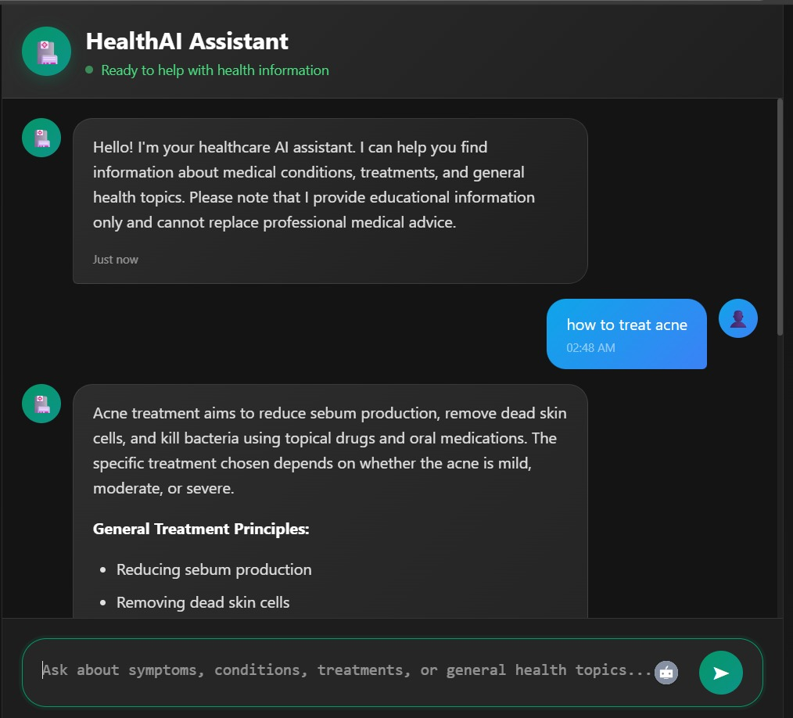
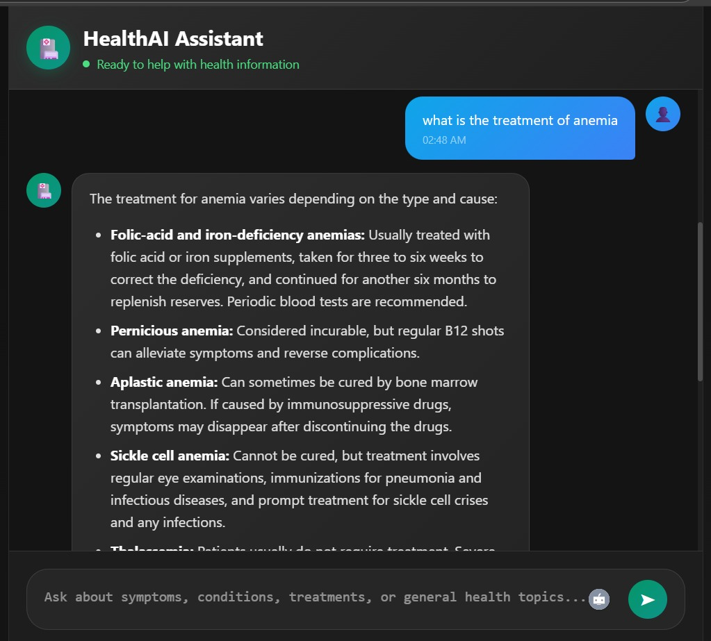
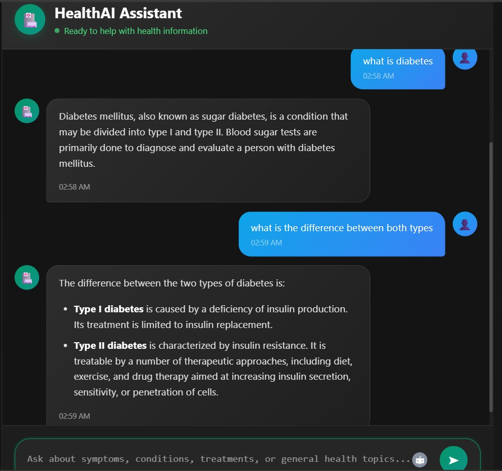

# Medical Chatbot

A smart medical information chatbot that uses AI to answer health-related questions. The bot processes medical PDF documents, stores them in a vector database, and uses Google's Gemini AI to provide accurate responses based on the stored medical knowledge.

## How It Works

1. **Document Processing**: PDF medical documents are loaded from the `data/` folder
2. **Text Splitting**: Documents are split into smaller, searchable chunks
3. **Vector Embeddings**: Text chunks are converted to numerical vectors using sentence-transformers
4. **Database Storage**: Vectors are stored in Pinecone vector database for fast similarity search
5. **Question Answering**: When you ask a question, the system:
   - Finds the most relevant document chunks
   - Sends them to Google Gemini AI
   - Returns a comprehensive answer based on the medical documents

## Tech stack

- **Python 3.10** - Programming language
- **Flask** - Web framework for the chatbot interface
- **Google Gemini AI** - AI model for generating responses
- **Pinecone** - Vector database for storing medical documents
- **LangChain** - Framework for building AI applications
- **HuggingFace Sentence Transformers** - For creating text embeddings
- **PyPDF** - For reading PDF documents
- **Docker** - For containerizing the application
- **AWS EC2** - Cloud server to host the chatbot
- **AWS ECR** - Docker image storage
- **GitHub Actions** - Automatic deployment   

## Project Structure

```
medical-chatbot/
├── app.py                     # Main Flask web application
├── requirements.txt           # Python packages needed
├── Dockerfile                # Instructions to build Docker container
├── .env.example              # Template for environment variables
├── setup.py                  # Package setup file
├── data/
│   └── gale_encyclopedia_of_medicine.pdf  # Medical documents
├── src/
│   ├── __init__.py           # Makes src a Python package
│   ├── helpers.py            # Functions for PDF processing & embeddings
│   ├── prompt.py             # AI prompt templates
│   └── store_index.py        # Script to create Pinecone vector database
├── templates/
│   └── chat.html             # Web chat interface
├── research/
│   └── notebook.ipynb        # Development and testing notebook
└── .github/
    └── workflows/
        └── cicd.yaml         # Automatic deployment configuration
```

## How to Run 

### Prerequisites

- **Python 3.10** (Download from [python.org](https://python.org))
- **Conda** (Download from [anaconda.com](https://anaconda.com))
- **Git** (Download from [git-scm.com](https://git-scm.com))
- **Pinecone Account** (Sign up at [pinecone.io](https://pinecone.io))
- **Google AI Studio Account** (Get API key from [aistudio.google.com](https://aistudio.google.com))

### Step 1: Clone the Project
```bash
git clone https://github.com/yourusername/medical-chatbot.git

cd medical-chatbot
```

### Step 2: Set Up Virtual Environment
```bash
conda create -n medical-chatbot python=3.10

conda activate medical-chatbot

```

### Step 3: Install Requirements
```bash
pip install -r requirements.txt
```

### Step 4: Set Up Environment Variables
```bash
cp .env.example .env

nano .env
```

Add your API keys to the `.env` file:
```
PINECONE_API_KEY="your-pinecone-api-key-here"
GEMINI_API_KEY="your-gemini-api-key-here"
```

### Step 5: Create the Vector Database

```bash
python src/store_index.py
```

### Step 6: Run the Chatbot
```bash
python app.py
```

## AWS Cloud Deployment (Automatic)

#### 1. Create IAM User for GitHub Actions
1. Go to AWS IAM Console
2. Create new user named `github-actions-user`
3. Attach these policies:
   - `AmazonEC2ContainerRegistryFullAccess`
   - `AmazonEC2FullAccess`
4. Create access keys and save them securely

#### 2. Create ECR Repository
1. Go to AWS ECR Console
2. Create repository named `medical-chatbot`
3. Copy the repository URI 

#### 3. Create EC2 Instance
1. Launch new EC2 instance:
   - **AMI**: Ubuntu 22.04 LTS
   - **Instance Type**: t3.large
   - **Security Group**: Allow ports 22 (SSH) and 8080 (HTTP)
2. Connect to your instance and install Docker:
```bash
sudo apt-get update -y
sudo apt-get upgrade
curl -fsSL https://get.docker.com -o get-docker.sh
sudo sh get-docker.sh
sudo usermod -aG docker ubuntu
newgrp docker
```

#### 4. Set Up GitHub Self-Hosted Runner
1. In your GitHub repo → Settings → Actions → Runners
2. Click "New self-hosted runner"
3. Select Linux x64
4. then run the commands GitHub provides on your EC2 instance

#### 5. Add Secrets to GitHub Repository
Go to your GitHub repo → Settings → Secrets and variables → Actions → New repository secret

Add these secrets:
- `AWS_ACCESS_KEY_ID` → Your IAM user access key
- `AWS_SECRET_ACCESS_KEY` → Your IAM user secret access key
- `AWS_DEFAULT_REGION` → Your AWS region (e.g., `us-east-1`)
- `ECR_REPO` → Your ECR repository name (`medical-chatbot`)
- `PINECONE_API_KEY` → Your Pinecone API key
- `GEMINI_API_KEY` → Your Google Gemini API key

GitHub Actions will automatically:
   - Build your Docker image
   - Push it to AWS ECR
   - Deploy it to your EC2 instance

Your chatbot will be live at: `http://your-ec2-public-ip:8080`

## Screenshots





